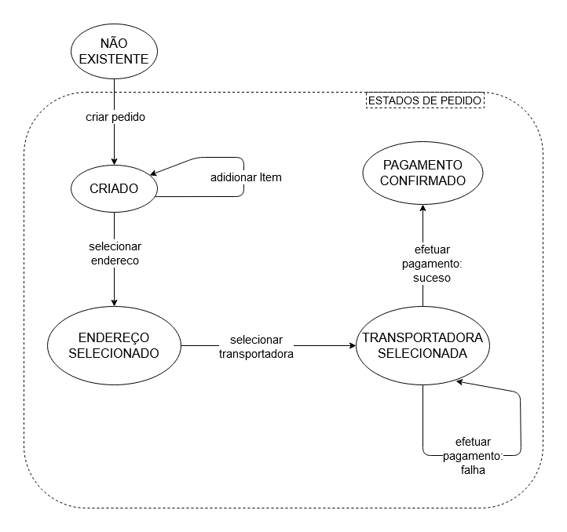
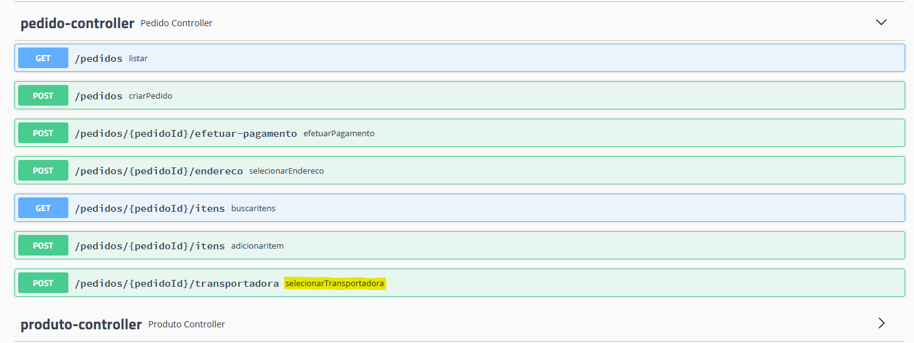

# checkout transparente, teste ithappens

Aplicação utilizando Spring Boot, MySQL, JPA e Hibernate.

## Requisitos

1. Java - 1.8.x
2. Maven - 3.x.x
3. Mysql - 5.x.x

## Passos para o SETUP

**1. Clone a aplicação**

```bash
git clone https://github.com/imcurvelo/checkout-transparente.git
```


**2. Modifique o usuário e senha de acordo com a sua instalação**

+ abra `src/main/resources/application.properties`

+ modifique `spring.datasource.username` e `spring.datasource.password` de acordo com sua instalação


O app vai rodar nesse endereço <http://localhost:8080>.

**3. Não é necessário criar database **
o projeto está configurado pra criar o database, as tabelas e fazer inserts básicos de teste

## Explore os endpoints da API

Para explorar os endpoints acesse o endereço <http://localhost:8080/swagger-ui.html>.

Você pode testar as APIs utilizando o Postman e o link para uma coleção de requests está aqui em baixo:
<https://www.getpostman.com/collections/1672519741a1878ab3c6>

## Fluxo da aplicação
Os estados da aplicação estão gerenciados de maneira a manter um fluxo.
Este fluxo está especificado na figura abaixo:



Os nomes das ações representadas pelas setas são métodos dos controllers e estão todos representados
por um endpoint, com nomes casados. Por exemplo, a ação "selecionar transportadora" tem um endpoint 
correspondente e é possível ver no swaggerui:


## Erros da aplicação
Quaisquer operações que poderiam tornar o estado da aplicação inválido retornará um erro adequado, por exemplo,
se tentarem selecionar a transportadora em um pedido em que o pagamento ja foi efetuado, a mensagem será a seguinte:

```json
{
    "status": 400,
    "type": "https://checkouttransparente.com/erro-negocio",
    "title": "Violação de regra de negócio",
    "detail": "operação inválida para o status atual (PAGAMENTO_CONFIRMADO) do pedido. os status permitidos para a operação são: [ENDERECO_SELECIONADO, TRANSPORTADORA_SELECIONADA]"
}
```